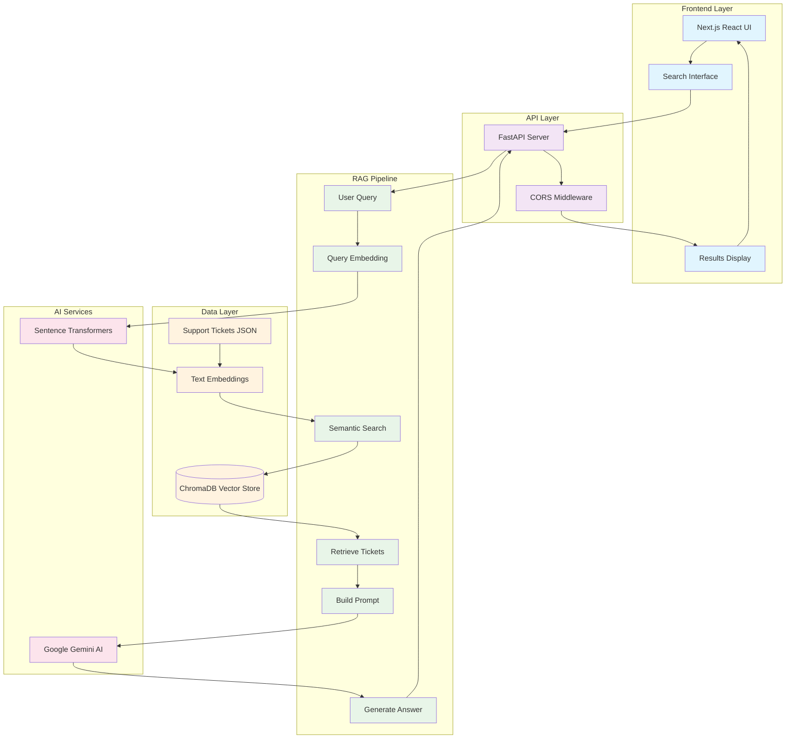

# SupportAI Knowledge Base

An AI-powered customer support analysis system that uses RAG (Retrieval-Augmented Generation) to answer questions based on historical support tickets.

## Features

- Natural language search with AI-generated answers
- Source ticket citations for transparency
- Modern, responsive web interface
- Fast semantic search using vector embeddings

## Architecture

The system uses a RAG (Retrieval-Augmented Generation) pipeline:

1. **Indexing**: Support tickets are converted to vector embeddings and stored in ChromaDB
2. **Query**: User questions are matched against stored embeddings to find relevant tickets
3. **Generation**: Google Gemini AI generates answers based on relevant ticket context

### System Architecture Diagram



## Tech Stack

**Backend:**
- FastAPI
- Google Gemini AI
- ChromaDB (vector database)
- Sentence Transformers (embeddings)

**Frontend:**
- Next.js with React
- Tailwind CSS
- Lucide React icons

## Quick Start

### Prerequisites
- Python 3.8+
- Node.js 18+
- Google API Key

### Setup

1. **Clone and install dependencies**
   ```bash
   git clone https://github.com/yourusername/customer-support-analyzer.git
   cd customer-support-analyzer
   
   # Backend
   cd backend
   pip install -r requirements.txt
   
   # Frontend
   cd ../frontend
   npm install
   ```

2. **Configure environment**
   ```bash
   # Create .env file in backend directory
   echo "GOOGLE_API_KEY=your_api_key_here" > backend/.env
   ```

3. **Add your data**
   ```bash
   # Create data directory and add your support_tickets.json
   mkdir -p data
   # Copy your support_tickets.json to data/
   ```

4. **Run the application**
   ```bash
   # Terminal 1 - Backend
   cd backend
   uvicorn src.api:app --reload
   
   # Terminal 2 - Frontend
   cd frontend
   npm run dev
   ```

   - Backend: http://localhost:8000
   - Frontend: http://localhost:3000

## Usage

Ask questions about support tickets in natural language:

- "How do I reset a user's password?"
- "What causes SSL certificate expiration errors?"
- "How to troubleshoot database connection timeouts?"

## Data Format

Support tickets should be in JSON format:

```json
[
  {
    "id": "ticket_001",
    "subject": "SSL Certificate Expiration",
    "body": "Customer reported SSL certificate expired error...",
    "resolution": "Renewed SSL certificate and updated DNS records"
  }
]
```

## Configuration

Create a `.env` file in the backend directory:

```env
GOOGLE_API_KEY=your_google_api_key_here
```

## License

MIT License


