# SupportAI Knowledge Base - Architecture Documentation

## Overview

The SupportAI Knowledge Base is built using a modern RAG (Retrieval-Augmented Generation) architecture that combines vector search with large language models to provide intelligent answers to support queries.

## System Architecture

### High-Level Architecture

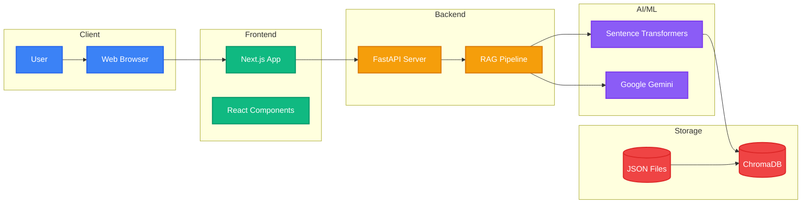

### Data Flow Architecture

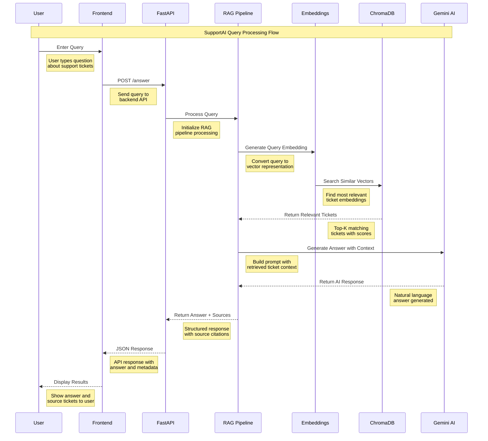

### Component Architecture

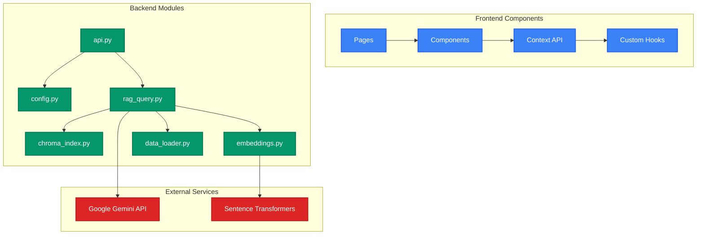

## RAG Pipeline Details

### 1. Indexing Phase

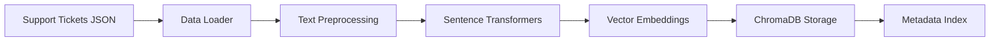

### 2. Query Phase

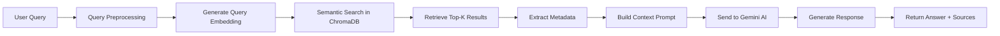

## Technology Stack

### Frontend Stack

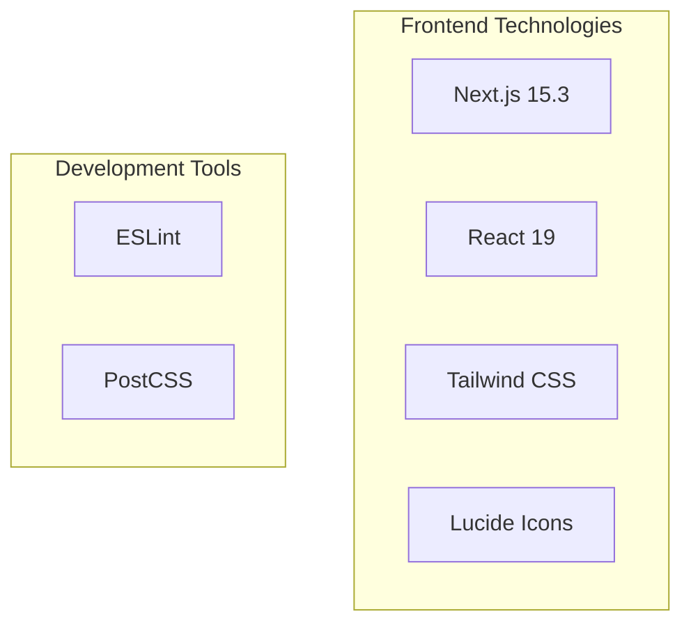

### Backend Stack

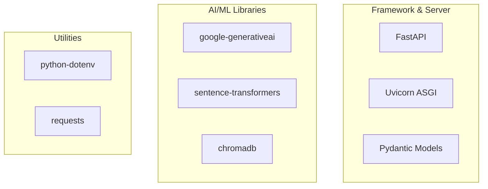

## Deployment Architecture

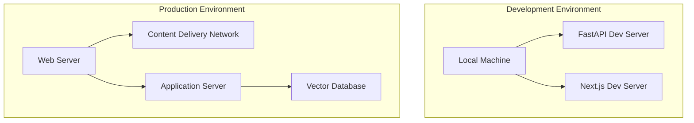

## Security Considerations

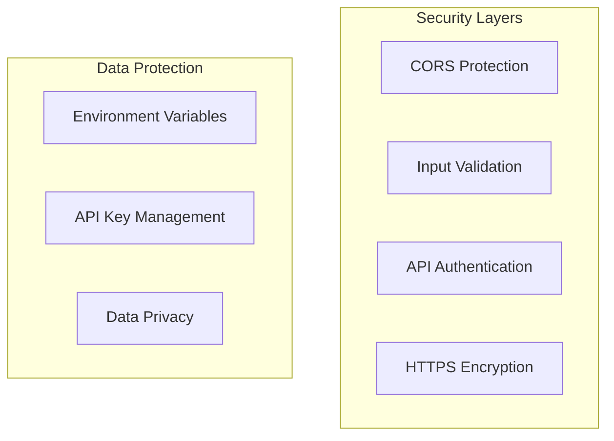

## Performance Optimization

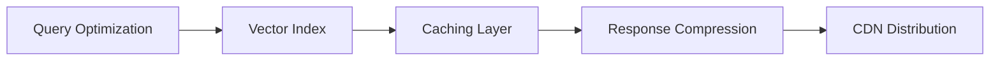

## Monitoring & Logging

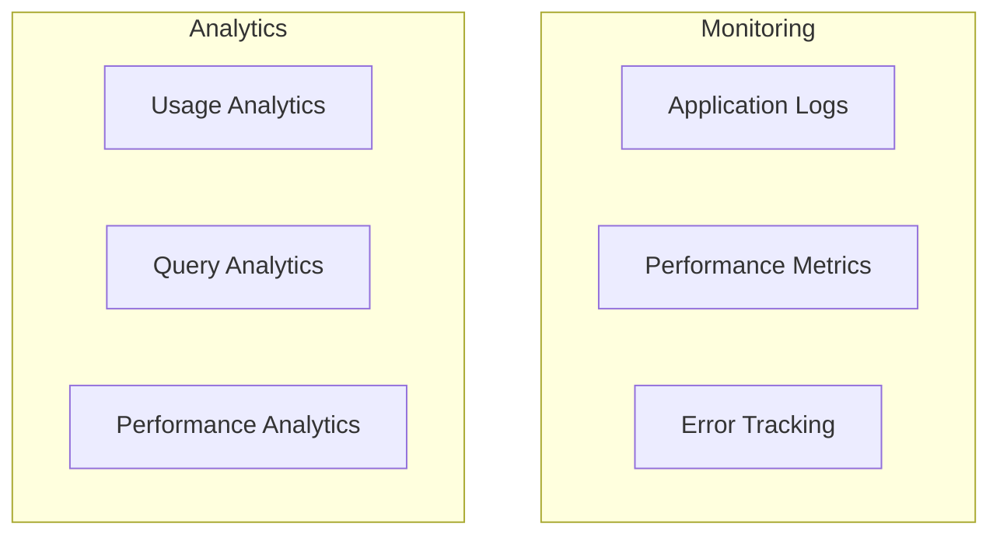

This architecture provides a scalable, maintainable, and efficient system for AI-powered customer support analysis.
